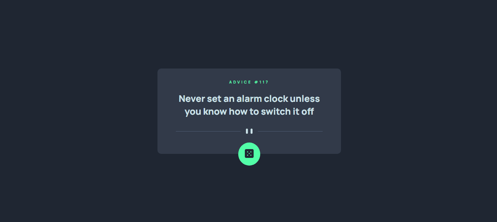
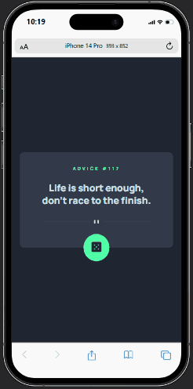

# Advice Generator

Projeto retirado do Frontend mentor que consome uma API de conselhos e altera entre os conselhos clicando no botão verde do card, o TypeScript presente no projeto foi decisão minha para praticar a linguagem.

## API usada

https://api.adviceslip.com

## Tecnologias usadas 👨‍💻

- HTML 

- CSS 

- JavaScript 

- TypeScript 

## Prévia Desktop 💻



## Prévia Mobile 📱



## Funcionalidades da aplicação 💡

Essa aplicação tem um botão que muda o conselho mostrado na tela para outro aleatório. Por estar consumindo uma API o card tem um delay para trocar o conselho.

## Passo a passo para clonar o projeto 📝

Para clonar o projeto, você pode usar o terminal de sua preferência, o passo a passo a seguir usa os comandos do gitbash como exemplo.

1 - Abra um terminal onde deseja colocar o projeto

2 - Clone o projeto
```
git clone "url do projeto"
```
3 - Acesse a pasta do projeto
```
cd projeto-advice-generator
```
4 - Instale as dependências do projeto
```
npm install
```
5 - Compile os arquivos TypeScript
```
npx tsc
``` 
ou
```
tsc
```
6 - Abra no vscode
```
code .
```
7 - Execute o projeto usando o Live server
